```mermaid {theme: 'forest', scale: 0.55}
flowchart TD
    A[🤖 AI Agent App] --> B[🧪 CI Evalset]
    B --> C[⚙️ Evals Run in CI]
    C --> D[🚀 Release to Production]
    D --> E[📊 Traces in Langsmith]
    E --> F[✍️ Annotate & Improve Evalset]
    F --> B

```

```mermaid {scale: 0.4}
flowchart LR
    Q["✨ Query"] --> M{"🔍 Semantic Match?"}

    subgraph CacheLayer ["Cache Layer"]
        M -.->|"✅"| C["🗄️ Cache"]
        C --> RC["📦 Retrieved steps"]
    end

    subgraph ReasonLayer ["Reason Layer"]
      M -.->|"❌"| R["🤖 LLM Reasoning<br/>💰 High Cost"]
      R --> S["🪜 Generate Steps"]
    end
    S -.->|"💾"| C
    RC --> EX["⚡ Execute"]
    S --> EX

    %% Styling
    classDef queryStyle fill:#e1f5fe,stroke:#01579b,stroke-width:2px
    classDef cacheStyle fill:#f3e5f5,stroke:#4a148c,stroke-width:2px
    classDef llmStyle fill:#fff3e0,stroke:#e65100,stroke-width:2px
    classDef executeStyle fill:#e8f5e8,stroke:#2e7d32,stroke-width:2px
    classDef decisionStyle fill:#fff9c4,stroke:#f57f17,stroke-width:2px

    class Q queryStyle
    class M decisionStyle
    class C,RC cacheStyle
    class R,S llmStyle
    class EX executeStyle

```

# AI Agents: Industrial Software Engineering
### Software Engineering Best Practices for AI Agents

---
layout: two-cols
layoutClass: gap-16
---
<div class="text-center">

# Introduction

</div>

- AI Engineering @ Rippling
- Founder, Cincotree.com <br/> AI training & consulting

<br/>
<hr/>

- VP Engineering, Simpl <br/>
(First buy-now-pay-later in India)

- Lead consultant, ThoughtWorks

- Moved from SF Bay area resecently to Dubai

<hr/>
<br/>

 https://www.linkedin.com/in/siliconsenthil/

 @siliconsenthil

::right::


---
transition: fade-out
layout: two-cols
layoutClass: gap-16
---
<div class="text-center">

# The Current State of AI Agents

</div>

<br/>
<br/>
<br/>

## It's 2025. We have a brand new reason.
<br/>

### _"It's AI! 🤷"_

::right::


---
layout: two-cols-header
layoutClass: gap-5
class: text-center
---

<div class="text-center">
  <h1>Hacking vs Engineering</h1>
</div>
::left::

::right::


---
transition: slide-up
layout: two-cols-header
layoutClass: gap-5
class: text-center
---
<div class="text-center">

# The Paradox of Progress

##### As an industry, we are in cross-roads. No authoritative answer.
<br/>

##### Embrace uncertainty. Gain confidence thru experiments for YOU, what works

</div>
::left::

::right::


---
layout: center
class: text-center
---

# What has changed?

<br/>
<br/>
<br/>

## Written code vs LLM Reasoning
<br/>

## LLM outputs are non-deterministic
<br/>

## Prompt Engineering: How to _program_ LLM?
<br/>

## Vibe coding: How much to rely on?
<br/>

---
layout: center
class: text-center
---

# What has NOT changed?

<br/>
<br/>
<br/>

## Don't break things
<br/>

## Always be fast
<br/>


## More code ➟ more bugs
<br/>

## Developer optimism
<br/>


## Murphy's Law
<br/>

---
class: text-left
---

# What we gonna learn

<br/>

### 💪 Ship with confidence

<br/><br/>

### 🧪 Embrace experiments

<br/><br/>

### ⚡ Speed as a feature


---
layout: section
---

# 💪 Ship with confidence


---

# Deterministic vs Non-deterministic Testing

<h3>🎯 Deterministic Tests</h3>

```python
import re

def extract_email(text: str) -> str | None:
    match = re.search(r"[a-zA-Z0-9._%+-]+@[a-zA-Z0-9.-]+\.[a-z]{2,}", text)
    if match:
        return f"The email id: {match.group(0).lower()}"
    return "Email not found"


def test_extract_email():
    response = extract_email("Contact me at Adam@example.com for details.")
    assert response == "The email id: adam@example.com"
```
<br>

- Fast execution
- Reliable CI/CD
- Easy debugging

---

# Deterministic vs Non-deterministic Testing

<h3>🎲 Non-deterministic Tests</h3>

````md magic-move {lines: true}
```python{none|1-5|5-30}
llm = DummyLLM()
# Prompt:     response = llm.run("Extract the email address from: Contact me at user@example.com for details. \
# When you cannot extract, say 'Email not found'. if you can find .... ")


@pytest.mark.slow
def test_extract_email_llm():
    response = llm.extract_email("Contact me at Adam@example.com for details.")

    email = extract_email(response)
    assert email == "The email id: user@example.com"
```
````
<br>

- Mostly works. But not deterministic.
- Costly to run
- Slower execution

---

# Deterministic vs Non-deterministic Testing

<h3>🎭 Use Mocks</h3>

```python {1-9|10-13|15-30}
@pytest.fixture
def mock_llm():
    return Mock(invoke={
        "content": "Create a calendar event.",
        "tool_calls": [{
            "name": "calendar.create",
            "args": {"title": "Sync with Alice", "start": "2025-10-01T15:00", "duration_min": 30}
        }],
    })

@pytest.fixture
def mock_calendar():
    return Mock(create={"id": "evt_123", "title": "Sync with Alice", "start": "2025-10-01T15:00"})

def test_calendar_agent(mock_llm, mock_calendar):
    agent = CalendarAgent(llm=mock_llm, tools={"calendar.create": mock_calendar})
    msg = agent.handle("Book a 30-min sync with Alice tomorrow at 3pm")
    mock_llm.invoke.assert_called_once()
    mock_calendar.create.assert_called_once_with(
        title="Sync with Alice", start="2025-10-01T15:00", duration_min=30
    )
    assert "evt_123" in msg and "Sync with Alice" in msg
```

---


# 🎲 Non-deterministic Testing aka Evals

<h3>⚖️ Evals: LLM as judge </h3>

```python {all}
def judge_score(query:str, expected:Dict[str,Any], got:Dict[str,Any])->Dict[str,Any]:
    client = OpenAI()
    rubric = (
      "You are an evaluator. Score 0..1 JSON: {\"score\":float,\"reason\":string}.\n"
      "Full credit if tool args match the user's intent, fields present and plausible."
    )
    prompt = f"""
User: {query}
Expected args: {json.dumps(expected)}
Got args: {json.dumps(got)}
Return ONLY JSON with keys score, reason.
"""
    r = client.chat.completions.create(
        model=os.getenv("OPENAI_MODEL","gpt-4o-mini"),
        messages=[{"role":"system","content":rubric},{"role":"user","content":prompt}],
        temperature=0
    )
    return json.loads(r.choices[0].message.content.strip())
```

---


# 🎲 Non-deterministic Testing aka Evals

<h3>⚖️ Evals: Have a large eval </h3>

```python {all}

EVALS = [
    ("Book 30-min sync with Alice tomorrow 3pm PST",
     {"title":"Sync with Alice","start":"2025-10-01T15:00","duration_min":30}),
    ("Schedule 1h review with Bob on Oct 2 at 10am",
     {"title":"Review with Bob","start":"2025-10-02T10:00","duration_min":60}),
    ("Add standup today 9am, 15min",
     {"title":"Daily Standup","start":"2025-09-27T09:00","duration_min":15}),
]

@pytest.mark.parametrize("query,expected", EVALS)
def test_calendar_agent_eval(query, expected):
    if not os.getenv("OPENAI_API_KEY"): pytest.skip("no key")
    tool, agent = CalendarTool(), CalendarAgent(RealLLM(), tool=CalendarTool())
    _ = agent.handle(query)
    got = tool.last
    verdict = judge(query, expected, got)
    assert verdict["score"] >= 0.8, verdict["reason"]
```

---

# 📝 Sidenote: Dependency Injection & `__call__`

```python {all}
class DummyNode:
    def __init__(self, llm=None, tools: Dict[str, Any]):
        self.llm = llm
        self.tools = tools

    def __call__(self, state: Dict[str, Any]) -> Dict[str, Any]:
        # Do something with self.llm and self.tools

# --- LangGraph wiring ---
builder = StateGraph(dict)
dummy_node = DummyNode(llm=real_llm, tools=real_tools)
builder.add_node("dummy", dummy_node)
builder.add_edge(START, "dummy")
builder.add_edge("dummy", END)
graph = builder.compile()

## Tests

DummyNode(mock_llm, mock_tools)
```

---

# ⛰️ Test pyramid

- Nodes testing: Both deterministic & non-deterministic

- Large node level tests

- Less graph level E2E tests

- Large Evalset > Higher confidence

---
layout: section
---

# 🧪 Embrace experiments

---
layout: two-cols-header
layoutClass: gap-5
---
# 🧑‍💻 🔄 🏭 Establish feedback loop

<div class="p-2 bg-purple-100 rounded text-center">
<strong>🌱🤖 Grow agents, don’t construct them</strong>
</div>


::left::

- Start with base evalset.
- Establish traces in production
- Collect user feedback
- Monitor and annotate to improve evalset
- Repeat

::right::


---

# 🧪 Experiment setups: Test in production

- A/B testing: Route traffic to parallel setups

<br/>

- Safeguard: User feedback based _(e.g. % 👎 disables the experiment in production)_

<br/>

- Bayesian: Use user feedback and dynamically switch

<br/>

- User cohort-based testing

<br/>

- Query based routing: Supervisor agent patterns

<br/>

- CI: Evalset against experiments

---
layout: section
---

# 🚀 Speed as a feature

---

# 🗄️ KV Cache

<div class="p-3 bg-purple-100 rounded text-center">
<strong>Which will perform better?</strong>
</div>

<div class="p-2 grid grid-cols-2 gap-8">

<div>
<h3> Version A</h3>

```text
System:
  You are SQLCopilot v3.1. (…800-token policies & examples…)
  Policies: …
User:
  [today=2025-09-27, org=Acme-42]
SCHEMA:
  tables: users(id, …), orders(id, …), -- (unordered)
TASK:
  Write a SQL for top spenders last 7d.
```

</div>

<div>
<h3>✨ Version B</h3>

```text
System:
  You are SQLCopilot v3.1. (…800-token policies & examples…)
  Policies: …
Style guide: …
SCHEMA (canonical order, stable formatting):
  users(id, …)
  orders(id, …)
User
  today=2025-09-27
  org=Acme-42
TASK:
  Write a SQL for top spenders last 7d.
```

</div>

</div>

---

# 🗄️ KV Cache


<div class="p-2 grid grid-cols-2 gap-8">

<div>
<h3>🐌 Version A</h3>

```text
# Baseline (low reuse)
System:
  You are SQLCopilot v3.1. (…800-token policies & examples…)
  Policies: …
User:
  [today=2025-09-27, org=Acme-42]
SCHEMA:
  tables: users(id, …), orders(id, …), -- (unordered)
TASK:
  Write a SQL for top spenders last 7d.
```

</div>

<div>
<h3>⚡ Version B</h3>

```text
System:
  You are SQLCopilot v3.1. (…800-token policies & examples…)
  Policies: …
Style guide: …
SCHEMA (canonical order, stable formatting):
  users(id, …)
  orders(id, …)
User
  today=2025-09-27
  org=Acme-42
TASK:
  Write a SQL for top spenders last 7d.
```

</div>

</div>
<div class="p-3 bg-blue-100 rounded">

- Freeze the header: identical system prompt
- Push volatility to the tail (User content in above example)
- Avoid drift: Consistent ordering (table order in schema)
- Chunk long exemplars: keep few-shot examples stable

</div>

---
layout: two-cols-header
layoutClass: gap-5
---
# 🗄️ Reasoning cache


::left::

- Store the cached steps

- Semantic matching based on embeddings


- Iterate on cache-hit ratio

::right::




---


# 🚫 Avoid LLMs for Simple Tasks

- ❌ LLM calls are **slow and costly**
- ✅ Use **embeddings or simple ML** for lightweight tasks

<br/>

### Examples
🧾 Intent detection → e.g., “book flight” vs “check weather” vs “play music”

🗂 Classification → sentiment (positive/negative), spam detection, topic tagging

🔍 Semantic search → retrieving FAQs, docs, or code snippets by similarity

🪄 Deduplication / clustering → grouping similar customer queries or tickets

🛠 Entity matching → “NYC” ≈ “New York City” (product, location, or name normalization)

🎶 Recommendation → “users who liked this song/movie also liked …”

📝 Anomaly detection → flagging unusual text or events

---

#### Example: Intent classification (with LLM)

```python {all}
from openai import OpenAI, ChatCompletion
import json

client = OpenAI()
ALLOWED = ["book_flight", "check_weather", "play_music"]

def detect_intent_llm(query: str):
    r = client.chat.completions.create(
        model="gpt-4o-mini",
        messages=[
          {"role":"system",
           "content": f"Classify into {ALLOWED}. Reply JSON {{'intent':...}}"},
          {"role":"user","content": query},
        ],
        temperature=0,
    )
    return json.loads(r.choices[0].message.content)["intent"]

# detect_intent_llm("Will it rain today?") → "check_weather"
```

---


#### Example: Intent classification (with Embeddings)

```python {all}
from openai import OpenAI
from sklearn.metrics.pairwise import cosine_similarity

client = OpenAI()

# Pre-compute embeddings for known intents
intent_texts = {
  "book_flight": "Book a flight ticket",
  "check_weather": "Check the weather",
  "play_music": "Play a song",
}
intents = {
  k: client.embeddings.create(model="text-embedding-3-small", input=v)
        .data[0].embedding
  for k, v in intent_texts.items()
}

def detect_intent(query):
    q_emb = client.embeddings.create(model="text-embedding-3-small", input=query).data[0].embedding
    sims = {intent: cosine_similarity([q_emb], [vec])[0][0] for intent, vec in intents.items()}
    return max(sims, key=sims.get)

---
layout: center
class: text-center
---

# Key Takeaways

<div class="grid grid-cols-3 gap-8 mt-8 text-left">

<div>

## 💪 Ship with confidence

<br/>

- Deterministic & Non-deterministic Testing
- Evals: LLM as Judge, Large Eval Sets
- Test Pyramid: Nodes → Graph → E2E

</div>

<div>

## 🧪 Embrace experiments
<br/>

- Establish Feedback Loops
- Grow Agents, Don't Construct
- A/B Testing in Production
- User Feedback Safeguards

</div>

<div>

## ⚡ Speed as a feature
<br/>

- KV Cache Optimization
- Reasoning Cache
- Avoid LLMs for Simple Tasks

</div>

</div>

---
layout: section
---
# Questions?

<br/>

### Senthil Velu Sundaram

 https://www.linkedin.com/in/siliconsenthil/

<br/>

 @siliconsenthil
